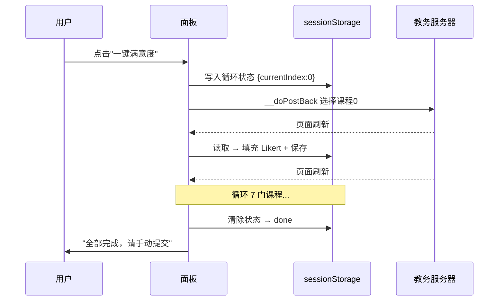
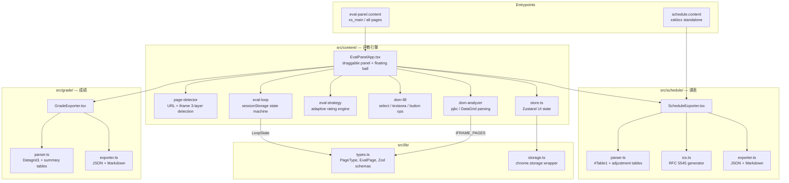

# 南邮教务助手 · NJUPT JWXT Assistant

<p align="center">
  
  
  
  
  
  
  
</p>

<p align="center">
  <b>Chrome MV3 浏览器扩展 — 南邮正方教务系统全方位增强</b><br>
  一键评教 · 课表导出 · 成绩导出 · 无侵入体验
</p>

---

## 功能

### 满意度调查 + 教学评价

一键自动完成 7 门课程的 Likert 量表（满意度）或教师评分（教学评价），自适应评分选项，逐门保存，sessionStorage 持久化跨页面连续执行。



| 特性 | 说明 |
|------|------|
| 智能评分策略 | 每位教师随机 1 个次高分，其余最高分，避免全满分被系统识别异常 |
| 自适应量表 | `option[1]`/`option[2]` 索引自动识别满意度/教学评价两种量表 |
| 跨页面持续 | sessionStorage 持久化，save→reload→continue 无需人工干预 |
| 弹窗自动屏蔽 | `document_start` 拦截 alert/confirm，保存弹窗不打断流程 |
| 可拖拽面板 | 按住标题栏拖动，`—` 折叠为悬浮球 `助`，点击展开 |
| iframe 自适应 | 全页面导航和 iframe 嵌入两种模式自动适配 |

### 课表导出

解析 `#Table1` 课表表格，支持 rowspan/colspan、单双周过滤，导出三种格式：

| 格式 | 用途 | 内容 |
|------|------|------|
| **ICS** (RFC 5545) | 导入 Apple/Google 日历 | 完整 iCalendar，含 Asia/Shanghai 时区 |
| **JSON** | AI 分析 / 程序处理 | 全量结构化数据，含调停补课、实践课、未安排课程 |
| **Markdown** | 人类阅读 / 笔记 | 7列×12行周课表 + 课程详情 + 辅助信息 |

学期开始日期默认按 NJUPT 校历算法自动推算（学期1=9月第2个周一，学期2=3月第1个周一），支持手动修改，按学号+学年+学期独立缓存。

### 成绩导出

解析 `Datagrid1` 成绩表格及附属摘要表，导出两种格式：

| 格式 | 内容 |
|------|------|
| **JSON** | 成绩明细(16字段) + 课程性质统计 + 课程归属统计 + GPA/排名 + 未通过课程 |
| **Markdown** | 成绩明细表格 + 课程性质/归属汇总 + 学分统计 |

支持 4 种查询模式：按学期 / 按学年 / 在校全部 / 已修最高，文件名自动区分。

---

## 架构



### 技术栈

| 层 | 选型 | 版本 |
|---|------|------|
| 框架 | WXT | 0.20 |
| UI | React + Tailwind CSS | 19 / 4 |
| 状态 | Zustand | 5 |
| 校验 | Zod | 4 |
| 语言 | TypeScript (strict) | 6 |
| 测试 | Vitest + jsdom | 4 |
| 构建 | Vite | 8 |

### 设计约束

- **Shadow DOM 隔离** — WXT `createShadowRootUi`，不污染宿主页面样式
- **iframe 三层检测** — contentWindow > src attribute > contentDocument，兼容 NJUPT 的 iframe 嵌套
- **pointer-events 管理** — WXT 注入的 shadow host wrapper 设 `none`，仅面板区域使用 `auto`
- **alert/confirm 抑制** — `document_start` 阶段 patch，阻止 ASP.NET 保存确认弹窗
- **sessionStorage 状态机** — 跨 ASP.NET postback 页面重载的 loop 持久化
- **零 `any` 类型** — TypeScript strict mode，所有边界 Zod 校验

---

## 快速开始

```bash
git clone https://github.com/hicancan/njupt-jwxt-assistant.git
cd njupt-jwxt-assistant
npm install
npm run build
```

Chrome → `chrome://extensions/` → 开启「开发者模式」→「加载已解压的扩展程序」→ 选择 `.output/chrome-mv3/`

> 也可从 [Releases](https://github.com/hicancan/njupt-jwxt-assistant/releases) 下载 `.zip` 直接加载。

### 开发

```bash
npm run dev         # 开发模式 (HMR)
npm run build       # 生产构建
npm run test        # Vitest (50 tests)
npm run typecheck   # tsc --noEmit
npm run check       # typecheck + test + build
```

---

## 版本历史

| 版本 | 日期 | 内容 |
|------|------|------|
| **v2.2.0** | 2026-06-11 | 成绩导出 (JSON/MD, 4种查询模式)、Markdown 多slot行显示、学期日期校历算法 |
| **v2.1.0** | 2026-06-04 | 课表 ICS 导出 + JSON/MD 增强、学生信息正则修复 |
| **v2.0.0** | 2026-06-04 | 全面重构：双评价引擎 + 可拖拽面板 + 悬浮球 + iframe 自适应 |
| **v1.0.0** | 2025-12-29 | 初版：评教 + 登录 + 课表 |

---

## License

ISC © 2025–2026
